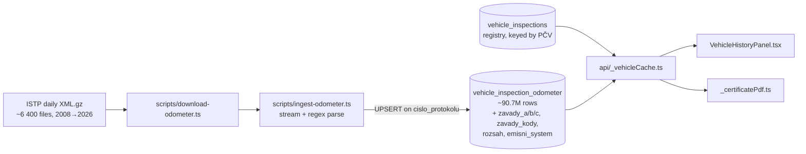
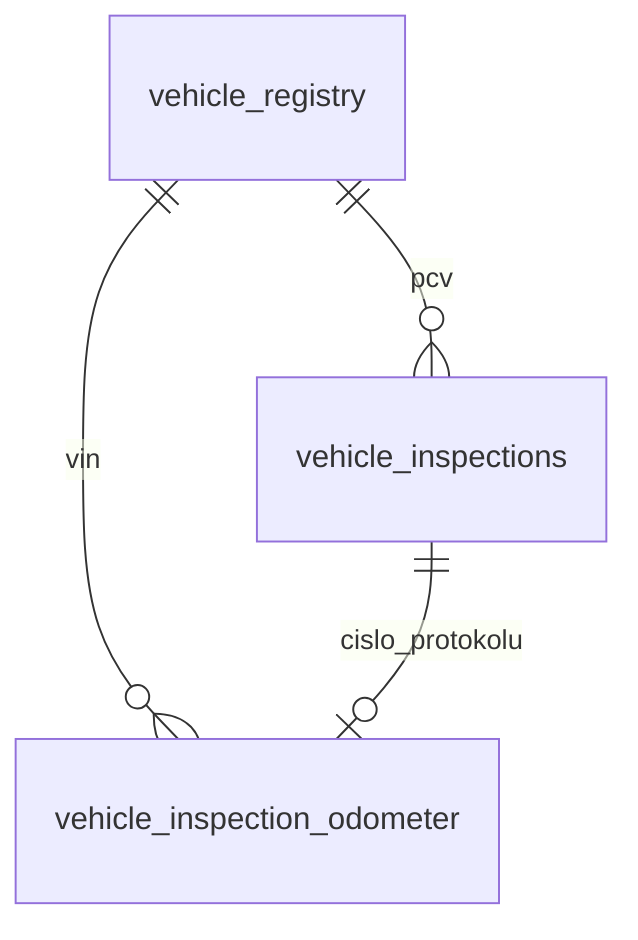
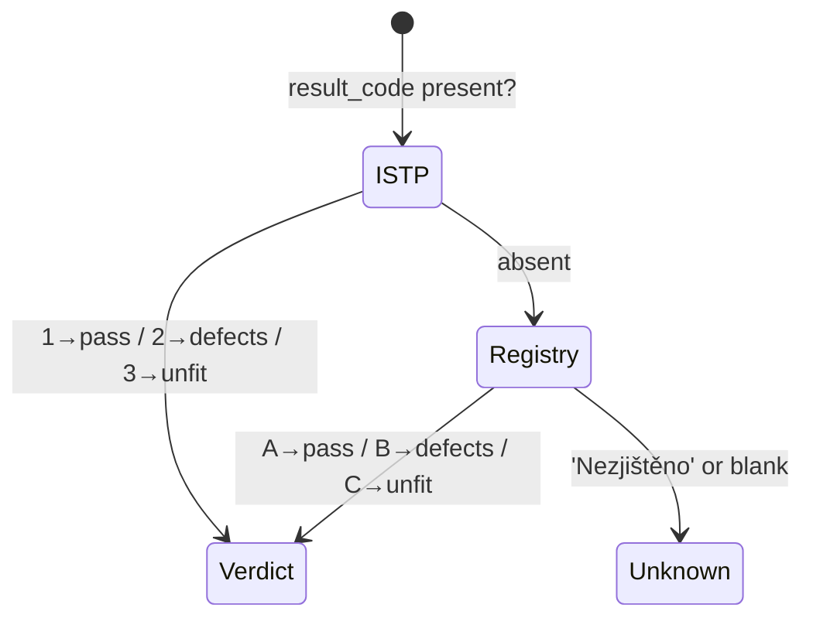

# feat: STK defect codes from ISTP + reworked inspection badge

## Goal Capsule

- **Objective:** Ingest the per-inspection defect list the ISTP open data already publishes (`Kod` + `Zavaznost`) into the existing odometer cache, then use it to (a) make the STK result badge trustworthy by sourcing it from ISTP instead of the sparsely-populated registry field, and (b) show a buyer *what* a vehicle was faulted on at each inspection, not just pass/fail.
- **Product authority:** Owner (vaclav.gabriel).
- **Storage decision (settled):** Variant C — widen `vehicle_inspection_odometer`, no new table.
- **Backfill decision (settled):** Full archive backfill 2009 → 2026.
- **Open blockers:** None.

---

## Context

A session investigating EV battery data confirmed the ISTP inspection feed carries no battery/SoH information, but surfaced that it carries considerably more than the seven columns we currently persist. The full tag inventory was taken from a real day file (`prohlidky_2026-06-06.xml.gz`, 1 403 inspections, 55 distinct tags).

Three findings drive this plan:

1. **Defect codes are complete and deep.** `Vysledek/ZavadaSeznam/Zavada/{Kod, Zavaznost}` is present and 100 % paired across every sampled year back to 2009. Sampled density: 2009 = 2.37 defects/inspection, 2015 = 1.80, 2021 = 1.11, 2026 = 0.60 (~1.63 weighted mean across samples).

2. **The protocol number joins the two sources exactly.** `vehicle_inspections.cislo_protokolu` (registry, keyed by PČV) and `vehicle_inspection_odometer.cislo_protokolu` (ISTP, keyed by VIN) match 1:1. Verified on `WVWZZZ1KZDP015799`: 8 of 8 protocols matched, and registry `stav='A'` lined up with ISTP `VysledekCelkovy=1` on every row.

3. **The current badge rests on a weak field.** `vehicle_inspections.stav` is `'Nezjištěno'` on ~190 k of a 500 k-row sample, including ~21 k *pravidelná* inspections. ISTP `VysledekCelkovy` is effectively always populated and carries the same three-way meaning.

4. **A Czech defect-text catalog exists and is machine-readable.** 1 193 entries (`{code, description, type}`) from the community STK Portál project, validated against 260 615 real defect occurrences across the eight sampled days. Coverage is strongly era-dependent:

| Year sampled | Defects | Code system | Catalog coverage |
|---|---|---|---|
| 2009 | 42 585 | 4-digit numeric | 0.0 % |
| 2012 | 26 857 | dotted | 90.6 % |
| 2015 | 38 167 | dotted | 87.8 % |
| 2017 | 40 587 | dotted | 81.6 % |
| 2018 | 33 143 | dotted | 80.6 % |
| 2021 | 35 009 | dotted | 100.0 % |
| 2024 | 1 136 | dotted | 100.0 % |
| 2026 | 838 | dotted | 99.9 % |

The catalog is complete for the inspections a buyer actually cares about — the last two or three — and degrades gracefully into history. The 2018 vyhláška renumbered the codes, so the pre-2018 tail needs a separate catalog it will not get in v1.

Existing shape this plan extends: `scripts/ingest-odometer.ts` (streaming regex parser + batched UPSERT), `scripts/migrations/004_vehicle_odometer.sql`, `.github/workflows/ingest-odometer.yml` (weekly, data-anchored window), `api/_vehicleCache.ts` (read layer, ~90.7 M-row table), `src/components/VehicleHistoryPanel.tsx` and `api/_certificatePdf.ts` (surfaces).

---

## Product Contract

### Problem

A buyer reading the STK history today sees only *Způsobilé / Způsobilé s vadami / Nezpůsobilé* — and on a large share of rows not even that, because the registry status field is blank. They cannot tell whether a "s vadami" verdict was a blown bulb or a corroded brake line, and a suspiciously clean history may just be missing data presented as fact.

### Primary actor

Consumer used-car buyer checking a specific vehicle on the free lookup and in the paid certificate. Same actor as the existing history panel.

### Behavior / requirements

- **R1 — Persist defects.** Every ISTP inspection record stores its defect count by severity (A/B/C) and the raw defect codes.
- **R2 — Persist two enum fields.** `RozsahProhlidky` (Plný / Částečný) and `EmisniSystem` (Řízený s OBD / Řízený bez OBD / Neřízený) are stored alongside.
- **R3 — Badge sourced from ISTP.** The per-inspection result badge uses ISTP `VysledekCelkovy` when available, falling back to the registry `stav`, and only then to `unknown`.
- **R4 — Show what was faulted.** Each inspection entry shows its defects resolved through the official catalog where possible ("Vnější krycí sklo potkávacího světlometu poškozené — lehká závada"), degrading to group + severity, then to severity + raw code. Never a claim beyond what the code says.
- **R5 — Honest empty state.** An inspection with no ISTP defect record renders as "závady neuvedeny", never as "bez závad". These are different facts and must not be conflated.
- **R6 — Certificate parity.** The certificate PDF's STK section reflects the same defect data and stops asserting "bez závady" from a field that cannot support it.
- **R7 — Full history.** Defect data is backfilled across the whole ISTP archive (2009 → 2026), not just forward from the next weekly run.

### Scope boundaries

**In scope:** schema widening, parser extension, full archive backfill, read-layer join, badge precedence, history-panel display, certificate PDF section.

**Deferred to follow-up work:**
- **Pre-2018 numeric code catalog.** 2009-era inspections use a wholly different 4-digit numbering (`7072`, `5104`) that the current catalog does not cover at all. DEKRA published an old→new conversion table (`stk-opava.cz/images/selection2.pdf`) that could be transcribed later; v1 shows severity and the raw code for these.
- **Gap-filling the 2012–2018 codes.** ~10–20 % of dotted codes from that era are absent from the current catalog (they were renumbered or retired by the 2018 vyhláška). Biggest single gap: `5.3.3.2.1`, 15 505 occurrences in the samples.
- Defect-based aggregate stats (`/znacky` "most common faults by brand") — attractive, but a separate data product on top of this one.
- `KontrolniUkon` / `Poznamka` free text (56 occurrences/day; low value, PII-adjacent free text needs its own review).

**Out of scope (decided against):**
- `AlternativniPalivo` — the registry `palivo` field already encodes LPG/CNG and `api/_fuelLabels.ts` already parses it into "Benzín + LPG".
- `DatumPristiProhlidky` — the registry already supplies STK validity via `PravidelnaTechnickaProhlidkaDo`.
- `Registrace/Stat` — already covered by the `vehicle_imports` table.
- `Stanice/{Kraj,ORP,Obec}` — `nazev_stk` already contains the full street address.

### Success criteria

- A vehicle with a known B-severity defect in its history shows that defect's group and severity in the panel and the PDF.
- Badge coverage measurably improves: rows that previously rendered "Neuvedeno" because of a blank registry `stav` now render a real verdict wherever ISTP has one.
- The weekly ingest continues to run green and idempotent after the change.
- No regression in lookup latency on the vehicle detail page.

### Assumptions

- Defect severity letters A/B/C carry the standard Czech meaning (lehká / vážná / nebezpečná). **Validated:** the feed's `Zavaznost` agrees with the catalog's independently-sourced `type` on 98.9 % of 190 684 matched occurrences.
- The leading segment of a dotted code maps to the Annex I group of Directive 2014/45/EU. Validated against the catalog, which spans groups 0–9 at depths 3–6.
- The catalog transcription is faithful to the official annex. Not verified against the MVČR PDF — flagged in KTD7 as a pre-ship spot-check.

---

## High-Level Technical Design

### Data flow



### Join model

The registry owns the inspection timeline (by PČV); ISTP owns the defect and result detail (by VIN). They meet on `cislo_protokolu`.



One wrinkle the join must absorb: **emission-station protocols are separate ISTP records.** For the sampled Golf, the 2022 inspection appears as `CZ-3715-22-06-0434` (technical) *and* `CZ-470202-22-06-0153` (emission station), each its own `<Prohlidka>`. Group-8 (emissions) defects can therefore land on a protocol number the registry row does not carry. The read layer merges ISTP siblings by `(vin, inspection_date)` before attaching them to a registry timeline entry.

### Badge precedence



---

## Key Technical Decisions

### KTD1 — Widen the existing table rather than add a defect table (variant C)

Store `zavady_a`, `zavady_b`, `zavady_c` (`SMALLINT`), `zavady_kody` (`TEXT[]`) and `zavady_zavaznosti` (`TEXT`) on `vehicle_inspection_odometer`. A normalised defect table would add **138 815 183 rows** (measured by a full-archive dry-run parse) to a shared Scaleway node that already carries 90.7 M. Variant C adds **zero rows**, and the read layer already queries this table on every lookup.

Trade-off accepted: we cannot cheaply query "all vehicles with defect 4.1.1.2.1" across the fleet. That is a follow-up data product, not this feature.

**Severity must travel with the code.** An earlier draft stored only the code array plus the three counts, which silently loses *which* code carried *which* severity. The catalog could recover it for covered codes, but ~27 % of historical codes are absent from it and their severity would be unrecoverable.

**Two storage choices exist purely to keep the row small**, because the volume they land on can never be shrunk:

- `zavady_zavaznosti` is a **compact string**, not a second `TEXT[]` — one character per code, positionally aligned ("BBA"). A parallel array would add a 24 B header plus 4 B/element padding to carry one letter each: **~1.3 GB** across the table.
- Clean inspections store **NULL**, not empty arrays. An empty array still costs ~16 B, and 52.9 M of the 90.7 M inspections have no defects: **~0.8 GB** to record nothing.

The counts therefore carry record-existence: `zavady_a IS NULL` means no ISTP record, `zavady_a = 0` with a NULL code array means recorded-and-clean. Together these cut the payload from 7.5 GB to **~4.5 GB**.

The node runs PostgreSQL 17.10, where adding a nullable column with no default is a catalog-only operation, so the `ALTER TABLE` is O(1) even at 90.7 M rows and does not rewrite the heap.

### KTD2 — Store raw codes; resolve text and group at read time

`zavady_kody` holds the codes verbatim (`'4.1.1.2.1'`). Nothing is interpreted at ingest time, so improving the catalog never requires a re-ingest.

Resolution happens in application code against a **snapshotted defect catalog** (see KTD7), with a three-step fallback:

1. **Exact catalog hit** → show the official Czech defect text.
2. **No hit, dotted code** → show the group derived from the leading segment (0 identification/plates · 1 braking · 2 steering · 3 visibility · 4 lighting · 5 axles/wheels/tyres · 6 chassis/body · 7 other equipment · 8 nuisance/emissions · 9 M2/M3 extras).
3. **No hit, non-dotted code** (pre-2018 4-digit numbering, e.g. `7072`) → show severity only, with the raw code. No group can be inferred.

### KTD3 — ISTP is the primary badge source, registry the fallback

`result_code` (`VysledekCelkovy`) 1/2/3 maps to the existing `StkResult` union exactly as `stav` A/B/C does, and is populated far more reliably. Keeping the registry as fallback means pre-2009 rows and registry-only protocols keep whatever verdict they have today — this is strictly additive coverage, never a downgrade.

### KTD4 — Relax the `odometer_km IS NOT NULL` read filter

`api/_vehicleCache.ts` currently selects odometer rows with `WHERE vin = $1 AND odometer_km IS NOT NULL`. ~5.5 % of ISTP records carry no odometer reading, and emission-station siblings routinely do not. Left as-is, those rows' defects and result codes would be invisible. The filter moves out of SQL and into the mileage-list construction, so the same query can serve both mileage and defects.

This is the most likely silent-failure point in the change: the feature would appear to work while quietly dropping data.

### KTD5 — Backfill runs out-of-band and in slices, not inside the weekly CI job

The weekly workflow resumes from a data high-water mark and is sized for one week of deltas. A 2009 → 2026 re-ingest is a one-off operator task: run locally under `caffeinate` with keepalive connection params and `--throttle`. The UPSERT is idempotent on `cislo_protokolu`, so the backfill is resumable and runs in slices with an explicit `VACUUM` between them — see U3 for slice sizing and the volume ceiling that drives it.

### KTD6 — Nullable everywhere, degrade silently

Every new column is nullable and the read layer's fault tolerance now covers **`42703` (undefined_column)** alongside `42P01`/`42501`. That third code is the one that matters here: the odometer query reads migration 007's columns, so a deploy landing before the migration is applied must degrade to "no defect data" rather than break every vehicle lookup. With it, deploy order is free and the app stays correct throughout the multi-day backfill.

Record-existence is read from **`zavady_a`, not from `zavady_kody`** — since KTD1 stores NULL for clean inspections, a NULL code array means either "clean" or "not backfilled", and only the count separates them. `zavady_a IS NULL` is what renders as "závady neuvedeny" (R5).

### KTD7 — Vendor the defect catalog as a static asset, do not call a third party at runtime

The Czech defect catalog (1 193 entries, `{code, description, type}`) is available as JSON from the community **STK Portál / OpenDataLab** project:

```
https://stk.opendatalab.cz/api/defects?limit=200&offset=<n>   # paginate; 1 193 rows total
```

It is a transcription of Příloha č. 1 to vyhláška č. 211/2018 Sb. The official annex itself is published only as a PDF on `aplikace.mvcr.cz`; neither `data.gov.cz` nor the ISTP XSD exposes a machine-readable codelist (both checked — the XSD leaves `Kod` untyped).

Snapshot it into the repo as a build-time asset rather than fetching at runtime: it is a third-party mirror with no uptime guarantee, and the underlying legal text changes only when the vyhláška is amended. Legal texts are excluded from copyright protection under §3 of the Czech copyright act, so vendoring the transcription is clean — but spot-check a handful of entries against the official annex before shipping, since the transcription itself is unverified.

---

## Implementation Units

### U1. Migration: widen `vehicle_inspection_odometer`

**Goal:** Add the defect and enum columns, additively and without blocking the live lookup path.

**Requirements:** R1, R2

**Dependencies:** none

**Files:**
- `scripts/migrations/007_inspection_defects.sql` (create)
- `scripts/ingest-odometer.ts` (modify — `--apply-schema` must pick up the new file alongside 004)

**Approach:** `ALTER TABLE ... ADD COLUMN IF NOT EXISTS` for `zavady_a SMALLINT`, `zavady_b SMALLINT`, `zavady_c SMALLINT`, `zavady_kody TEXT[]`, `zavady_zavaznosti TEXT[]`, `rozsah TEXT`, `emisni_system TEXT`. All nullable, no defaults, no new indexes — reads are always by the existing `(vin, inspection_date)` index. No re-grant is needed: `vincheck_api` holds a **table-level** `SELECT` on this table, which covers columns added later. Carry forward the production-safety header comment style used in 004.

**Patterns to follow:** `scripts/migrations/004_vehicle_odometer.sql` — its header documents apply-as-admin instructions and the additive-only guarantee.

**Test scenarios:**
- Applying the migration twice in a row succeeds and is a no-op the second time.
- After apply, `vincheck_api` can `SELECT` the new columns without an explicit re-grant (pins the table-level-grant assumption).
- An existing row is untouched: its `odometer_km`, `vin`, and `cislo_protokolu` are unchanged and the new columns read as `NULL`.

**Verification:** `\d vehicle_inspection_odometer` shows seven new nullable columns; a live vehicle lookup on the deployed app still returns its mileage history unchanged.

---

### U2. Parser: extract defects and the two enum fields

**Goal:** Read `ZavadaSeznam`, `RozsahProhlidky`, and `EmisniSystem` out of each `<Prohlidka>` block and carry them through the batched UPSERT.

**Requirements:** R1, R2

**Dependencies:** U1

**Files:**
- `scripts/ingest-odometer.ts` (modify)

**Prerequisite:** a small local sample set — not the full archive. Fetch roughly a dozen days spanning the eras the parser must survive, into `$CSV_DIR/odometer-xml/`:

| Sample | Why it earns a slot |
|---|---|
| 2009-06-01 | pre-2018 4-digit numeric codes, no `AlternativniPalivo` |
| 2015-06-01, 2017-06-01 | dotted codes from the pre-211/2018 revision |
| 2018-06-01 | first era with `AlternativniPalivo` present |
| 2021-06-01 | high-volume weekday, 100 % catalog coverage |
| 2026-06-06 | current shape; contains three real EVs (no `EmisniCast`) and a weekend's low volume |

Total ~15 MB. `--dry-run` needs no database and no credentials, so this is the whole local dev loop.

**Approach:** The existing `first(block, tag)` helper returns a single value and is not sufficient for a repeated list. Add a sibling helper that extracts all `<Zavada>` sub-blocks and reads `Kod` + `Zavaznost` from each — the XML is flat and regular, so regex remains appropriate and a parser dependency is not warranted.

Three parsing constraints established from the real feed:
- `EmisniCast` nests its own `CisloProtokolu`, `DatumProhlidky`, `Stanice/Cislo` and `CasoveUdaje`. The existing code already relies on `first()` returning the outer occurrence; the new fields must not accidentally read from the nested block. `RozsahProhlidky` and `EmisniSystem` each occur at most once per record, so `first()` is safe for them.
- The published XSD permits `ZavadaSeznam` under **three** parents — `Vysledek`, `TechnickaCast`, and `TskCast`. In practice 100 % of observed `<Zavada>` elements sit under `Vysledek` (checked across a 2015 and a 2026 file, 39 005 defects, zero exceptions). Parse every `<Zavada>` in the record rather than scoping the match to `Vysledek`, so a future ISTP change surfaces instead of silently dropping defects.
- Severity values observed are exactly `A`, `B`, `C`. Anything else should count into none of the three buckets but still land in `zavady_kody`, so unexpected values are visible rather than dropped.

Extend `Record`, `COLS`, the tuple builder, and the `ON CONFLICT DO UPDATE` set-list. Counts are `0` (not `NULL`) when `ZavadaSeznam` is absent but the record parsed, so "zero defects" and "no data" stay distinguishable.

**Execution note:** `--dry-run` already exists and needs no DB. Extend its sample output to print the new fields, and use it as the primary feedback loop for this unit.

**Patterns to follow:** existing `toRecord()` / `upsertBatch()` in the same file; the dedupe-within-batch guard must continue to work unchanged.

**Test scenarios:**
- A record with two `<Zavada>` entries (`A` and `B`) yields `zavady_a=1`, `zavady_b=1`, `zavady_c=0`, and both codes in `zavady_kody` in document order.
- A record with no `ZavadaSeznam` yields counts of `0` and an empty (not null) code array.
- A petrol record whose `EmisniCast` nests `CisloProtokolu` still resolves the *outer* protocol number — regression guard on the existing behaviour.
- An EV record (no `EmisniCast` at all, e.g. the Tesla Model Y in the 2026-06-06 file) parses cleanly with `emisni_system` null and a valid odometer.
- A record with an unrecognised `Zavaznost` value keeps the code in `zavady_kody` without incrementing any counter.
- Re-running the ingest over the same file twice leaves identical rows (idempotency of the extended UPSERT).
- `--dry-run` over the 2026-06-06 sample reports 838 defects across 1 403 records, matching the counts measured from the raw file.

**Verification:** `--dry-run` totals for a known day file match the counts obtained by grepping the raw XML.

---

### U3. Full archive backfill (2009 → 2026)

**Goal:** Populate the new columns across the whole ISTP history, in slices small enough that the shared node never approaches its volume limit.

**Requirements:** R7

**Dependencies:** U1, U2

**Files:** none (operator task; no code change)

**Approach:** Re-run the ingest in slices with `--from`/`--to`, `VACUUM`ing the table between them. The archive is already on disk (see the download figures below); the two halves are independent, so the fetch never gates the ingest. Run under `caffeinate -i` with keepalive connection params, per the pattern already established for long-running index builds on this node.

**Why batched UPSERT and not an atomic swap.** The repo's `load_via_swap` (`scripts/ingest-vehicle-cache.sh`) is the natural fit for a full rebuild and would be faster — it builds indexes once after the load instead of maintaining them across 90.7 M row updates. It was rejected on storage: a swap holds both copies at once, peaking near 94 GB and needing a ~105 GB volume. Scaleway block volumes [cannot be shrunk](https://www.scaleway.com/en/docs/managed-databases-for-postgresql-and-mysql/how-to/manage-volumes/), so that capacity would be a permanent cost for a one-off operation. Batched UPSERT peaks ~25 GB lower for a slower run.

**Sizing.** Volume is 100 GB; database is 65 GB before the backfill.

| | measured / projected |
|---|---|
| Archive on disk | 10 GB, 6 442 files, 0 failed (~35 min at concurrency 5) |
| Records to rewrite | 90 756 382 (0 skipped in the full parse) |
| Defects to store | 138 815 183 across 37 818 233 records (41.7 %) |
| Payload after the KTD1 optimisations | **~4.5 GB** (down from 7.5 GB); rehearsal measured 49.3 B/row — see below |
| Heap fragmentation from row growth | ~1.5 GB |
| Index bloat (new columns are unindexed, but full pages defeat HOT) | ~2 GB |
| **Database after backfill** | **~73 GB (73 % of volume)** |
| **Peak during a slice** | **~75 GB (75 %)** |

**Payload measured, not just projected (2026-08-18).** A full rehearsal of the 2008-2009 slices against a local PostgreSQL put the seven new columns at **49.3 B/row** (counters 6.0 · codes 33.6 · severities 3.2 · rozsah 6.5 · emisni_system 0.0). Two corrections have to be applied before extrapolating, and they pull in opposite directions:

- **Codes get longer.** Every code in 2008-2009 is the 4-character legacy form (`4012`); the post-2018 catalog uses the dotted form (`5.3.3.2.1`, 9 chars), which costs ~12 B per array element instead of ~8 after alignment.
- **Defects get rarer.** 63.9 % of the rehearsal's rows carry defects against 41.7 % across the full archive, and 3.95 codes each against 3.67.

Netting both out over 90 756 382 rows gives **~4.1 GB**, so the 4.5 GB line above is the conservative end of a measured range rather than a guess. `emisni_system` measuring 0.0 B is era-specific too — it is empty throughout 2008-2009 and only populated later.

**Slicing.** Size slices so one slice's dead tuples stay well under a gigabyte — roughly 2–3 M rows, i.e. months rather than years. `VACUUM vehicle_inspection_odometer` after each slice returns that space to the table's free space map for the next slice to reuse, which is what keeps the peak flat instead of climbing.

Note that autovacuum has **never run** on this table (`autovacuum_count = 0`) because it has only ever been INSERTed into. It will start firing during the backfill, but with `autovacuum_work_mem` at 150 MB against 90.7 M rows and two indexes it is slow — do not rely on it. Run `VACUUM` explicitly between slices.

Because the load is idempotent on `cislo_protokolu`, a failed or interrupted slice is simply re-run.

**Execution note:** Run one slice first, then measure wall-clock, `pg_database_size`, and node load before committing to the rest. Stop and reassess if the database passes 85 GB (85 %) at any point rather than pushing through — Scaleway puts an instance into read-only [`disk_full` mode](https://www.scaleway.com/en/docs/managed-databases-for-postgresql-and-mysql/troubleshooting/disk-full/) when the volume fills, which would take the live lookup path down with it.

**Test scenarios:** `Test expectation: none — operator task with no behavioural code change.` Verified by the outcome checks below.

**Verification:**
- Coverage query: `zavady_a IS NOT NULL` approaches 100 % for slices already ingested.
- Invariant holds: no row where `length(zavady_zavaznosti) <> array_length(zavady_kody, 1)`.
- Clean inspections store NULL, not empty arrays: no row with
  `zavady_a = 0 AND zavady_b = 0 AND zavady_c = 0 AND zavady_kody IS NOT NULL`.
  All three counters are required. `zavady_a` is the count of A-severity
  defects, not a record marker, so a B/C-only inspection legitimately has
  `zavady_a = 0` alongside a populated code array — 42 626 such rows in the
  2008-2009 rehearsal alone. Testing `zavady_a` on its own reports every one
  of them as corruption.
- Counters agree with the payload: no row where
  `zavady_a + zavady_b + zavady_c <> array_length(zavady_kody, 1)`.
- No orphans in either direction: no row with codes but no severity string,
  or a severity string but no codes.
- Spot check: the sampled Golf's 2016 inspection carries the same defect codes visible in that day's raw XML.
- `pg_database_size` lands near the projected 73 GB; if it materially exceeds it, stop and re-measure before continuing.
- The weekly CI job runs green on its next scheduled execution afterwards.

---

### U4. Read layer: join defects onto the inspection timeline

**Goal:** Surface defect and ISTP-result data through `getVehicleHistory` so both the web panel and the PDF can consume it.

**Requirements:** R1, R3, R4, R5

**Dependencies:** U1 (deployable before U3 completes — data simply arrives progressively)

**Files:**
- `api/_vehicleCache.ts` (modify)
- `src/types/index.ts` (modify — extend the `inspections.history` entry shape)

**Approach:** Extend the existing ISTP query to select the new columns and drop `odometer_km IS NOT NULL` from the `WHERE` clause (KTD4), filtering for the mileage list in application code instead. Key the ISTP rows by `cislo_protokolu` and additionally group them by `(inspection_date)` so emission-station siblings merge into the matching registry entry.

Attach to each `history` entry: severity counts, derived defect groups, and the ISTP result code. Add a field recording which source produced the badge verdict — useful for diagnosing coverage and for an honest UI tooltip.

Add a small pure helper mapping a defect code to its group label, colocated with the other formatting helpers.

Keep the existing `42P01`/`42501` catch intact: a not-yet-migrated column set must degrade to "no defect data", never throw.

**Patterns to follow:** the fault-tolerant `.catch()` wrappers on the `vehicle_imports` / `vehicle_equipment` / odometer queries in the same `Promise.all`; `stavToResult()` for the shape of the mapping helpers.

**Test scenarios:**
- A protocol present in both sources merges into one timeline entry, not two.
- An emission-sibling protocol's group-8 defect attaches to the same date's registry entry.
- An ISTP row with `odometer_km IS NULL` still contributes its defects, and is excluded from the mileage list.
- Registry row with no ISTP counterpart yields `defects: null` (not an empty list) so the UI can distinguish "no data" from "no defects".
- Defect group derivation: `4.1.1.2.1` → lighting, `8.2.1.2.1` → emissions, `1.1.12.2.1` → braking, and an unparseable code falls back to an "other" bucket without throwing.
- A vehicle with no ISTP rows at all returns the same history shape it does today (regression guard).

**Verification:** `/api/vehicle?vin=WVWZZZ1KZDP015799` returns defect fields on the inspections whose protocols were verified to match, and the existing mileage array is byte-identical to before the change.

---

### U5. Badge precedence

**Goal:** Derive the per-inspection verdict from ISTP first, registry second.

**Requirements:** R3

**Dependencies:** U4

**Files:**
- `api/_vehicleCache.ts` (modify)

**Approach:** Replace the direct `stavToResult(r.stav)` call with a precedence helper taking both the ISTP result code and the registry `stav`. Keep `stavToResult` as-is for the registry arm — it is already correct and used elsewhere. The aggregate `failed` count in the inspections summary should move to the same precedence so the count and the per-row badges cannot disagree.

**Test scenarios:**
- ISTP `1` + registry `'Nezjištěno'` → `pass` (the coverage win this unit exists for).
- ISTP absent + registry `'B'` → `defects` (fallback preserved).
- ISTP `3` + registry `'A'` → `unfit`, with ISTP winning; assert explicitly so the precedence direction is pinned.
- Both absent → `unknown`.
- The summary `failed` count equals the number of history entries whose resolved verdict is `defects` or `unfit`.

**Verification:** A vehicle previously showing "Neuvedeno" on an inspection now shows a real verdict, and the summary line's failure count matches the badges below it.

---

### U8. Vendor the defect catalog

**Goal:** Bring the official Czech defect texts into the repo as a versioned static asset with a reproducible refresh path.

**Requirements:** R4

**Dependencies:** none (can land first; independent of the data pipeline)

**Files:**
- `api/_defectCatalog.json` (create — the snapshot)
- `api/_defects.ts` (create — lookup + fallback chain)
- `scripts/fetch-defect-catalog.ts` (create — refresh script, run by hand, not in CI)

**Approach:** The refresh script pages `stk.opendatalab.cz/api/defects` (200 per request, 1 193 rows) and writes a sorted, stable-key JSON snapshot so diffs are reviewable when the vyhláška changes. The lookup module implements the KTD2 three-step fallback and exposes both the resolved text and the derived group.

**Resolution happens server-side.** The snapshot is ~246 KB — too much to ship to the browser for a feature most visitors never expand — and the certificate PDF is generated server-side anyway, so resolving in `api/` keeps web and PDF on one code path and costs the client bundle nothing. Both tsconfigs already set `resolveJsonModule`, so the JSON is inlined by the bundler rather than read from disk at runtime.

**Patterns to follow:** `api/_fuelLabels.ts` and `api/_vehicleFieldLabels.ts` — the repo's existing convention for static Czech label maps with a classify-then-fallback shape. Note `vercel.json` scopes `includeFiles` per function; a bundler-inlined JSON import needs no entry there, but confirm on first deploy.

**Test scenarios:**
- A known code resolves to its official text and severity (`4.1.1.2.1` → A, headlight lens damage).
- A dotted code absent from the catalog (`5.3.3.2.1`) falls back to the axles/wheels/tyres group with its feed-supplied severity.
- A pre-2018 numeric code (`7072`) falls back to severity plus raw code, and derives no group.
- A malformed or empty code returns the "other" bucket without throwing.
- The snapshot parses and contains the expected entry count; a truncated download fails the script loudly rather than writing a partial file.

**Verification:** Re-running the fetch script against an unchanged upstream produces a byte-identical file.

---

### U6. History panel: show defects

**Goal:** Render the resolved defects and their severity under each inspection entry, with an honest empty state.

**Requirements:** R4, R5

**Dependencies:** U4, U5, U8

**Files:**
- `src/components/VehicleHistoryPanel.tsx` (modify)
- `src/App.css` (modify — reuse the existing `stk-entry` / `stk-station` styling vocabulary)

**Approach:** Below the existing station address line, list the defects resolved through `defectCatalog`, ordered most-severe first, each with its severity. Official texts are long full sentences, so truncate with the full text available on expand rather than wrapping four lines per defect. Reuse the existing `STK_COLOR` palette so severity reads consistently with the badge above it. Where no ISTP defect record exists, render "závady neuvedeny" in muted text — never "bez závad" (R5).

The standing footnote about records being available "zhruba od roku 2009" already sets the right expectation for missing history and needs no change.

UI copy is Czech; code comments English, per repo convention.

**Test scenarios:**
- An entry with one A and one B defect renders both, B first.
- A defect whose code is not in the catalog renders its group label, and a pre-2018 numeric code renders severity plus raw code — neither is dropped from the list.
- A long official defect text truncates without breaking the layout, and expands on interaction.
- An entry with `defects: null` renders the "závady neuvedeny" muted state.
- An entry with an empty defect array renders "bez závad" — the distinct, positive case.
- An administrative (`kod_stk = '9999'`) entry keeps its "nové vozidlo" badge and shows no defect line.
- An entry with many defects does not overflow its container on a narrow viewport.

**Verification:** The panel renders correctly for a vehicle with a known B-severity defect, a vehicle with a clean history, and a vehicle with no ISTP coverage.

---

### U7. Certificate PDF: defect-aware STK section

**Goal:** Bring the paid certificate to parity and correct a claim it currently cannot support.

**Requirements:** R4, R5, R6

**Dependencies:** U4, U5, U8

**Files:**
- `api/_certificatePdf.ts` (modify)
- `scripts/render-vin-cert.ts` (used for verification, not modified)

**Approach:** The summary badge currently reads `STK: N× bez závady` whenever `failed === 0` — an assertion the registry data cannot back, and now demonstrably wrong for vehicles that passed *with* A-severity defects. Reword against real defect data, and extend the "Historie STK" section with the per-inspection defect groups.

Keep the PDF's existing `STK_LABEL` map in sync with the web's.

**Test scenarios:**
- A vehicle that passed with A-severity defects no longer renders "bez závady" in the summary tile.
- The STK history section lists defect groups for inspections that have them.
- A vehicle with no ISTP defect coverage renders the section exactly as it does today (no empty rows, no layout break).
- Render across the reference VIN set (car, bus, truck, motorcycle, motorhome) without layout regressions — motorcycles and trailers have markedly different inspection shapes.

**Verification:** `pnpm tsx scripts/render-vin-cert.ts <VIN> out.pdf` across the reference VIN set produces correct, non-overflowing pages.

---

## Verification Contract

| Gate | How |
|---|---|
| Type-clean | `pnpm exec tsc --noEmit` passes for both the app and `api/` |
| Formatting | `pnpm exec biome check --write` leaves no diff |
| Parser correctness | `--dry-run` counts on `prohlidky_2026-06-06.xml.gz` match raw-XML greps (1 403 records / 838 defects) |
| Idempotency | Re-ingesting one day twice produces identical rows |
| No lookup regression | Vehicle detail page for a reference VIN renders identically pre/post for mileage and owner history |
| Certificate | Reference VIN set renders without layout breaks |
| Weekly job | Next scheduled `ingest-odometer.yml` run completes green |

---

## Risks & Dependencies

| Risk | Impact | Mitigation |
|---|---|---|
| Backfill load destabilises the shared Scaleway node | Live lookups degrade during a multi-day window | Year-sized slices, `--throttle`, off-peak, temporary node scale-up; measure 2009 before committing to the rest (U3 execution note) |
| The `odometer_km IS NOT NULL` filter is left in place | Defects silently missing on ~5.5 % of records and most emission siblings | Called out as KTD4 with a dedicated test scenario in U4 |
| Emission-sibling protocols double-render the timeline | Buyer sees the same inspection twice | Merge by `(vin, inspection_date)`; explicit U4 test scenario |
| Severity letters mean something other than assumed | Mislabelled severity in a paid product | Recorded as an assumption; confirm against vyhláška 211/2018 Sb. before U6 copy is finalised |
| Backfill outgrows the Scaleway volume | Scaleway flips the instance to read-only `disk_full` mode, taking the live lookup path down with it | Volume raised to 100 GB; projected peak 75 %; slice-wise `VACUUM`; hard stop at 85 GB |
| Upstream catalog API disappears | Defect texts unresolvable | Vendored as a static asset (KTD7); no runtime dependency |
| Catalog gaps read as "no defect" | Buyer under-informed on older cars | Three-step fallback (KTD2) always renders something; per-era coverage documented in Context |
| ISTP publishing stalls again mid-backfill | Backfill incomplete for recent dates | Already handled — the weekly job anchors to the data high-water mark and fails loudly when the source stops |
| `ALTER TABLE` behaves unexpectedly at 90.7 M rows | Lock on the live read path | Resolved — server is PostgreSQL 17.10 and the columns are nullable with no default, so the change is catalog-only |

**Dependencies:** admin DB credentials for the migration and backfill; 10 GB local disk for the archive (already downloaded); no new packages.

---

## Open Questions

- **Catalog fidelity.** The vendored catalog is a community transcription, spot-checked only against the feed's own severity values (98.9 % agreement). Verify a sample against the official MVČR PDF before U6 ships.
- **Group label wording.** "osvětlení" vs "světla", etc. A copy decision for U6, against the vocabulary already used elsewhere in the panel.

---

## Definition of Done

- Migration applied; all six columns present and readable by `vincheck_api`.
- Parser extracts defects and both enum fields; `--dry-run` counts verified against raw XML.
- Full 2009 → 2026 backfill completed; coverage query confirms non-null defect data across the archive.
- Badge resolves from ISTP with registry fallback, and the summary failure count agrees with the per-row badges.
- Defect catalog vendored, with a reproducible refresh script.
- History panel and certificate PDF both resolve defects through the catalog with the full fallback chain, and both render "závady neuvedeny" — never "bez závad" — where data is absent.
- Verification Contract gates all pass; weekly ingest green on its next run.

---

## Sources & Research

- Raw feed inspected directly: `prohlidky_2026-06-06.xml.gz` (1 403 inspections, 55 distinct tags, full inventory taken) plus samples from 2009-06-01, 2012-06-01, 2015-06-01, 2016-06-01, 2017-06-01, 2018-06-01, 2021-06-01, 2024-06-01.
- Protocol-number join verified live against the Scaleway cache on `WVWZZZ1KZDP015799`.
- Registry `stav` sparsity measured on a 500 k-row sample; EV field sparsity on a random 1 % `TABLESAMPLE`.
- Defect catalog: `https://stk.opendatalab.cz/api/defects` (community STK Portál / OpenDataLab), 1 193 entries, validated against 260 615 real defect occurrences — see the coverage table in Context.
- Official annex: Příloha č. 1 to vyhláška č. 211/2018 Sb., published as PDF only at `aplikace.mvcr.cz/sbirka-zakonu`. Confirmed absent from `data.gov.cz` (no codelist dataset for publisher 66003008) and from the ISTP XSD (`Kod` is untyped).
- Pre-2018 old→new code conversion table: `stk-opava.cz/images/selection2.pdf` (DEKRA), unused in v1.
- Defect-code grouping follows Annex I of Directive 2014/45/EU.
- Related existing docs: `docs/plans/ODOMETER_READINGS.md`, `docs/FEATURE_ODOMETER_TRACKING.md`, `docs/VEHICLE_HISTORY_PANEL.md`.
